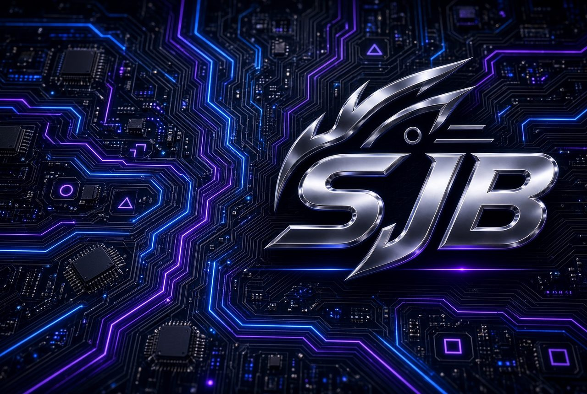

# sjb

PS5 jailbreak host.

**Link:** https://x-f1reball-x.github.io/sjb/

## Firmwares

**Supported: 9.00 – 12.00 only.**

Other firmwares will not work on this host. If you are on a different firmware, install [WK Autoloader](https://github.com/X-F1REBALL-X/WK-Autoloader) manually.

## What it does

After jailbreak, the host can install:

1. **Payload Manager**
2. **WK Autoloader** (homescreen app)

**No download needed.**

### First jailbreak

On the first jailbreak, **WK Autoloader is not installed**.

Payload Manager installs first and opens automatically. That blocks the install page for WK Autoloader.

### Install WK Autoloader (second jailbreak)

1. In Payload Manager, turn off the auto-open / auto-entry page
2. Run the jailbreak again from this host
3. You should then get the redirect to install **WK Autoloader**

After reboot, open **WK Autoloader** from the homescreen to jailbreak again without the browser host.

The Autoloader updates **only if a newer version is available**. Same version is skipped.

## Setup

1. Open the link on the PS5 browser
2. Wait for the jailbreak to finish
3. First run: Payload Manager installs (WK Autoloader does not yet)
4. Turn off Payload Manager auto-open
5. Jailbreak again from this host
6. Install WK Autoloader when the page asks
7. Reboot
8. Open **WK Autoloader** from the homescreen

Homescreen app: [WK Autoloader](https://github.com/X-F1REBALL-X/WK-Autoloader)

## Credits

**Thanks**: jordyidk · TheFloW · Gezine · Echo Stretch · itsPLK · and the scene
